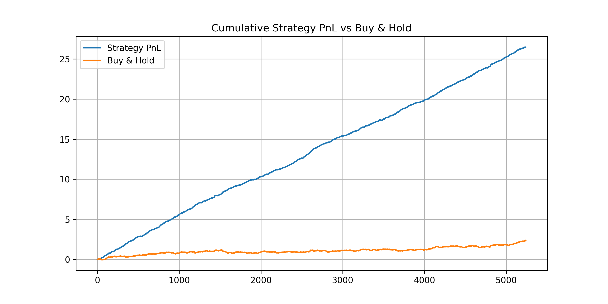
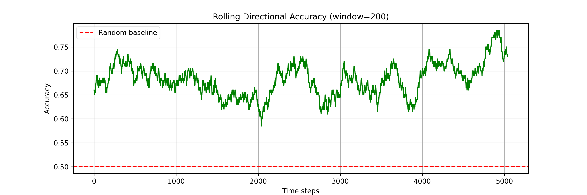
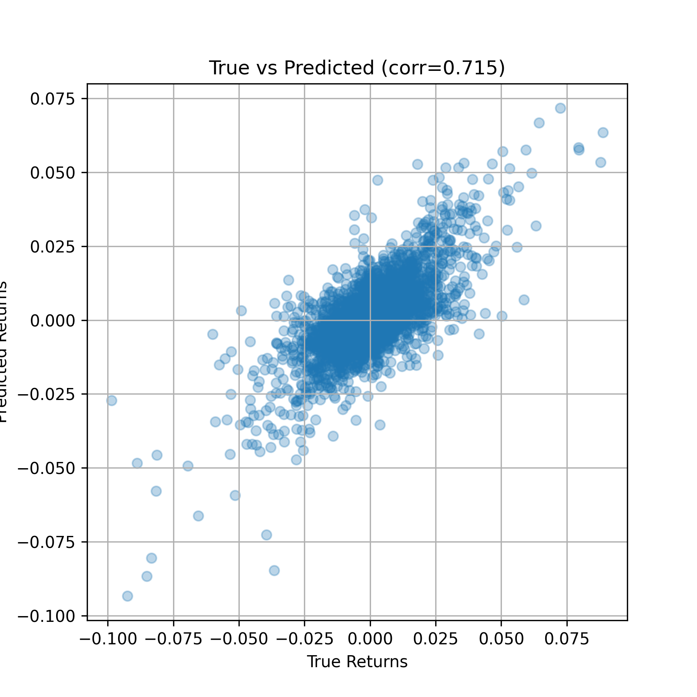
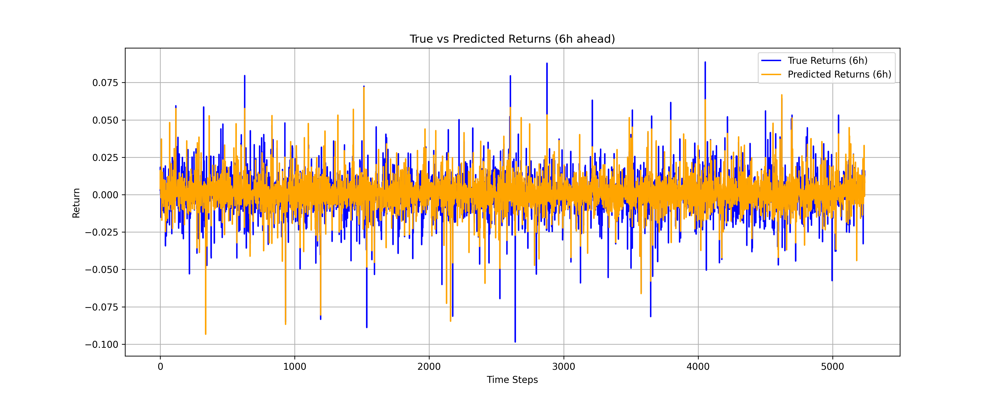
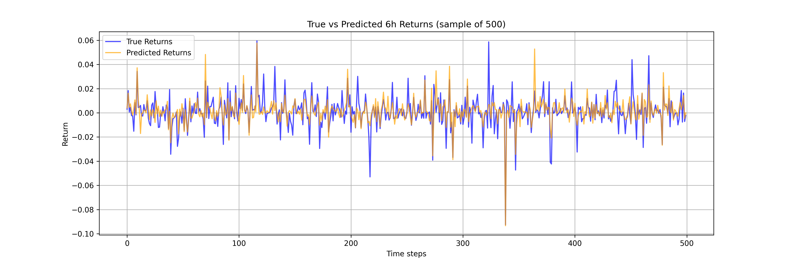

# AlphaMind: Transformer-Based BTC/USDT Predictive Model
--------------------
AlphaMind is a **Transformer sequence model** that predicts **BTC/USDT returns** using engineered technical indicators (RSI, MACD, Bollinger Bands, etc.).  
It generates **profitable trading signals** by capturing short-to-medium-term return patterns.

---

## 🚀 Features

✅ Fetches & caches **Binance BTC/USDT OHLCV data**  
✅ Engineers **advanced features** (returns, RSI, MACD, Bollinger Bands, etc.)  
✅ Trains a **Transformer model** for sequence forecasting  
✅ Evaluates predictions using **MSE, R², directional accuracy, return correlation**  
✅ Visualizes results with **PnL curves, accuracy plots, and scatter comparisons**  

---

## Project Organization
--------------------

    ├── README.md                               <- The top-level README for developers using this project.
    │
    ├── data                                    <- Cached Binance OHLCV datasets.
    │
    ├── results                                 <- Generated plots and metrics are saved here.
    │   ├── plots                               <- Visualization outputs (PnL, scatter, rolling accuracy, etc.).
    │   └── metrics.json                        <- Saved metrics (MSE, R², accuracy, correlation).
    │
    ├── requirements.txt                        <- The requirements file for reproducing the analysis environment.
    │
    ├── alpha_mind.py                           <- Main script for fetching data, training, evaluating, and plotting.
    


## Prerequisites
-------------

- Linux, macOS, or Windows
- Python 3.8+
- CPU or NVIDIA GPU + CUDA for faster training

## Installation
------------

Create a working environment (conda or venv recommended) and activate it.

Clone this repository:
```bash
git clone https://github.com/your-repo/AlphaMind.git
cd AlphaMind
```
Install dependencies:
```bash
pip install -r requirements.txt
```
---
## 🏃‍♂️ Usage
------------
Run the main script to:

1. Fetch and cache **Binance BTC/USDT OHLCV data**  
2. Engineer features (**returns, RSI, MACD, Bollinger Bands, etc.**)  
3. Train the **Transformer sequence model**  
4. Evaluate predictions and generate visualizations
---

## 📊 Model Evaluation
------------
Key validation metrics:

- **Validation MSE:** `7.726e-05`  
- **Validation R² Score:** `0.497`  
- **Directional Accuracy:** `68.26%`  
- **Return Correlation:** `0.715`  

These metrics show the model captures **meaningful return patterns**, enabling **profitable trading signals**.
---

## 📈 Visual Outputs & Analysis
------------
### ✅ 1. Cumulative Strategy PnL vs Buy & Hold
- The **blue curve (Strategy PnL)** grows steadily, showing consistent profits.  
- The **orange curve (Buy & Hold)** remains mostly flat.  

**Key takeaway:** The model significantly **outperforms passive strategies**, demonstrating **clear alpha generation**.



---

### ✅ 2. Rolling Directional Accuracy
- Maintains **65–75% accuracy**, well above the **50% random baseline**.  
- Robust to market regime changes.  

**Key takeaway:** The model **retains predictive edge even during volatility**.



---

### ✅ 3. True vs Predicted Scatter Plot
- Shows **strong positive correlation (corr ≈ 0.715)**.  
- Most points cluster around the diagonal → **good magnitude & direction alignment**.  

**Key takeaway:** Predictions are **well-aligned with actual returns**, validating **predictive power**.



---

### ✅ 4. True vs Predicted Returns (Full Series)
- Predicted returns follow the **overall trend** but are **smoother** (noise reduction).  
- Captures **directional movements** well, even if extreme spikes are dampened.


---

### ✅ 5. True vs Predicted 6h Returns (Sample of 500)
- Predicted values **closely track ups & downs**.  
- Better at **medium-term trends** than **high-frequency noise**.


## 📊 Quick Summary Table

| **Metric / Plot**        | **Value / Insight**                               |
|--------------------------|--------------------------------------------------|
| **Validation MSE**       | `7.726e-05` (low prediction error)               |
| **Validation R²**        | `0.497` (moderate explanatory power)             |
| **Directional Accuracy** | `68.26%` (well above random guessing)            |
| **Return Correlation**   | `0.715` (strong predictive alignment)            |
| **Cumulative PnL**       | Significantly outperforms **Buy & Hold**         |

---

## 💡 Implications
------------
- The **cumulative PnL curve** demonstrates strong **alpha generation** over a passive strategy.  
- The model’s signals can be used for **live automated trading** with further enhancements:  
  - ✅ Multi-asset support  
  - ✅ Hyperparameter optimization  
  - ✅ Modeling **transaction costs & slippage**  
  - ✅ Advanced **risk management** and **position sizing**  

---

## 🚀 Future Improvements
------------
- ✅ **Multi-asset support** with portfolio-level backtesting  
- ✅ **Hyperparameter tuning** with Optuna  
- ✅ Incorporating **transaction costs & slippage**  
- ✅ Advanced **risk management** and **position sizing**  

---

## 📜 License
------------
This project is licensed under the **MIT License**.  

You are free to use, modify, and distribute with proper attribution.  
